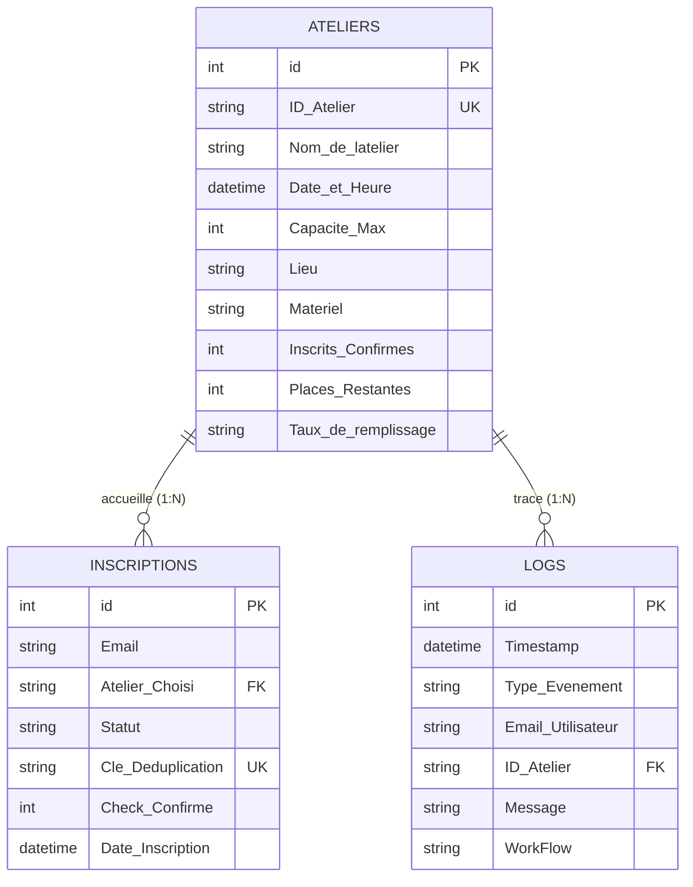

# 🚀 SkillBoost Academy — Système d'automatisation des inscriptions

Solution d'automatisation no-code / low-code pour la gestion de bout en bout des inscriptions, déduplication, gestion des files d'attente FIFO, rappels automatiques et émargement terrain.

---

## 🛠️ Stack Technique

* **Moteur d'orchestration :** n8n (Community Edition) VPS
* **Base de données relationnelle :** Baserow Cloud
* **Interfaces & Canaux :** Telegram Bot API (`@SkillBoost_Admin_Bot`), Gmail API
* **Résilience & Failover :** Gestionnaire d'erreurs global (alertes hors-bande OVH SMS)

---

## 🏗️ Architecture des Workflows n8n

* **WF-00 :** API Disponibilité Ateliers (catalogue en direct)
* **WF-01 :** Inscription aux Ateliers SkillsBoost
* **WF-02 :** Traitement Inscription DB (contrôle d'intégrité & idempotence)
* **WF-03 :** Gestion Annulation & Repêchage (FIFO automatique)
* **WF-04A :** Relances Automatiques J-1 (CRON matinal)
* **WF-04B :** Relances H-2 (CRON horaire)
* **WF-05A :** Génération Liste d'Appel (Telegram Bot `/appel`)
* **WF-05B :** Clôture Session & Émargement interactif
* **WF-ERR :** Gestionnaire d'Erreurs Globales & Circuit Breaker

---

## 🗄️ Schéma Relationnel des Données (Baserow)

---

## 🔒 Sécurité & Idempotence

* **Unicité :** Clé composite `email_idAtelier` calculée avant toute écriture.
* **Annulation dynamique :** Altération de la clé sous la forme `email_idAtelier_timestamp` pour autoriser une réinscription ultérieure.
* **Audit :** Journalisation de chaque transition d'état dans la table `Logs`.
