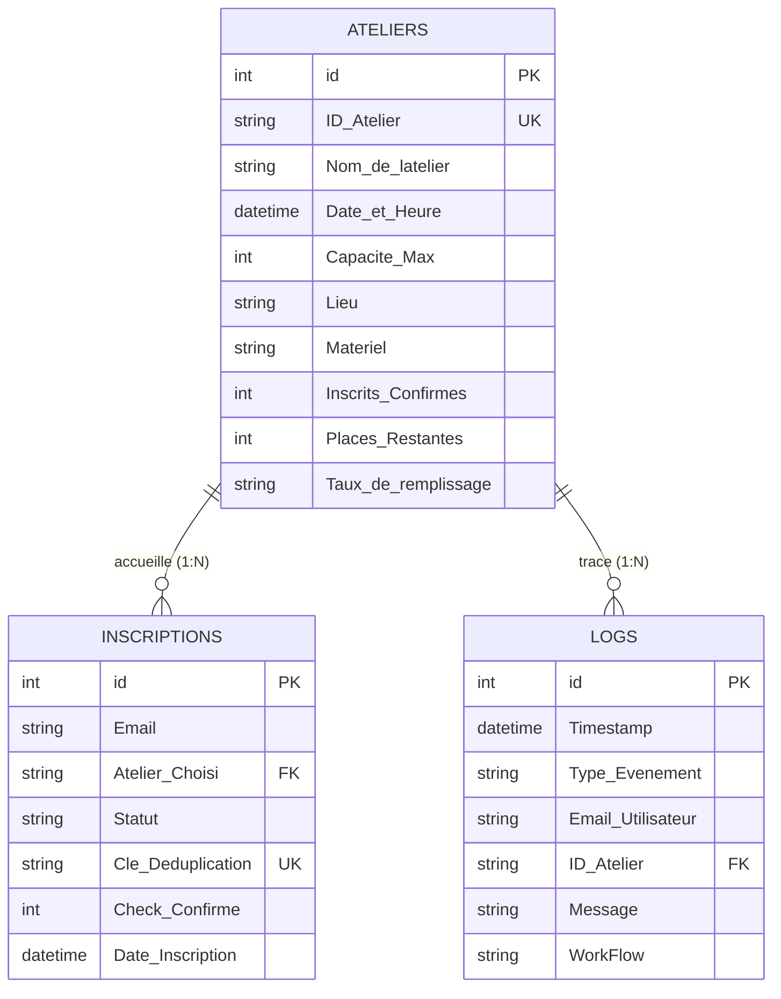

# 🚀 SkillBoost Academy — Système d'automatisation des inscriptions

Solution d'automatisation no-code / low-code pour la gestion de bout en bout des inscriptions, déduplication, gestion des files d'attente FIFO, rappels automatiques et émargement terrain.

---

## 🛠️ Stack Technique

* **Moteur d'orchestration :** n8n (Community Edition) VPS
* **Base de données relationnelle :** Baserow Cloud
* **Interfaces & Canaux :** Telegram Bot API (`@SkillBoost_Admin_Bot`), Gmail API
* **Résilience & Failover :** Gestionnaire d'erreurs global (alertes hors-bande OVH SMS)

---

### 🏗️ Architecture des Workflows n8n

* [**WF-00**](Workflows/WF-00%20_%20API%20Disponibilite%20Ateliers.json) : API Disponibilité Ateliers (catalogue en direct)
* [**WF-01**](Workflows/WF-01%20_%20Inscription%20aux%20Ateliers%20SkillsBoost.json) : Inscription aux Ateliers SkillsBoost
* [**WF-02**](Workflows/WF-02%20_%20Traitement%20Inscription%20DB.json) : Traitement Inscription DB (contrôle d'intégrité & idempotence)
* [**WF-03**](Workflows/WF-03%20_%20Gestion%20Annulation%20%26%20Repechage.json) : Gestion Annulation & Repêchage (FIFO automatique)
* [**WF-04A**](Workflows/WF-04A%20_%20Relances%20Automatiques%20J-1.json) : Relances Automatiques J-1 (CRON matinal & clôture waitlist)
* [**WF-04B**](Workflows/WF-04B%20_%20Relances%20H-2.json) : Relances H-2 (CRON horaire)
* [**WF-05A**](Workflows/WF-05A%20_%20Generation%20Liste%20d'Appel%20BOT.json) : Génération Liste d'Appel (Telegram Bot `/appel`)
* [**WF-05B**](Workflows/WF-05B%20_%20Cloture%20Session%20%26%20Emargement.json) : Clôture Session & Émargement interactif
* [**WF-ERR**](Workflows/WF-ERR%20_%20Gestionnaire%20d'Erreurs%20Globales.json) : Gestionnaire d'Erreurs Globales & Circuit Breaker

  
---

## 📁 Structure du projet

```text
.
├── workflows/
│   ├── WF-00 _ API Disponibilité Ateliers.json
│   ├── WF-01 _ Inscription aux Ateliers SkillsBoost.json
│   ├── WF-02 _ Traitement Inscription DB.json
│   ├── WF-03 _ Gestion Annulation & Repêchage.json
│   ├── WF-04A _ Relances Automatiques J-1.json
│   ├── WF-04B _ Relances H-2.json
│   ├── WF-05A _ Génération Liste d'Appel [BOT].json
│   ├── WF-05B _ Clôture Session & Émargement.json
│   └── WF-ERR _ Gestionnaire d'Erreurs Globales.json
└── README.md
```


---

## 🔒 Sécurité, Idempotence & Résilience

### 1. Gestion de l'idempotence et cycle de vie des données
* **Unicité stricte :** Clé composite `email_idAtelier` calculée avant toute écriture pour empêcher les inscriptions en doublon.
* **Annulation dynamique :** Altération de la clé sous la forme `email_idAtelier_timestamp` pour autoriser une réinscription ultérieure en cas d'annulation.
* **Clôture de liste d'attente (WF-04A) :** À J-1, les participants non repêchés passent au statut `Expirée`. La clé est altérée en `email_idAtelier_EXPIRED` afin de libérer l'accès aux futures sessions du même atelier.

### 2. Tolérance aux pannes (Fault Tolerance)
* **Résilience API Gmail (WF-02, WF-04A, WF-04B) :** Politique de réessais automatiques (3 tentatives, intervalle de 2 000 ms) et routage vers une branche d'erreur dédiée (`error output`) journalisant l'échec dans la table `Logs` sans crasher le workflow.
* **Découplage Telegram (WF-02, WF-05A) :** Poursuite en sortie standard sur les alertes secondaires pour garantir que les opérations critiques d'inscription ou d'émargement ne soient jamais interrompues par une indisponibilité réseau.
* **Audit & Traçabilité :** Journalisation systématique dans la table `Logs` via l'identifiant dynamique `{{ $workflow.name }}` et horodatage ISO.
